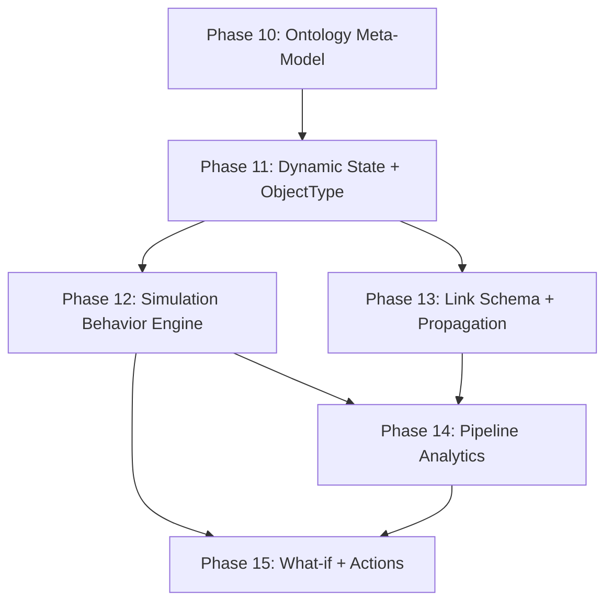

# To-be Phases 전체 로드맵

## 1. 비전

> **"임의의 속성을 가진 객체들이 최소한의 규약에 맞게 관계를 맺고 시뮬레이션하며, 운영 상태를 분석하여 의사결정을 지원하는 서비스"**

Phase 1~9에서 구축한 에셋 모델·시뮬레이션·이벤트 파이프라인·알림 체계를 기반으로, 도메인 무관한 온톨로지 메타모델 위에서 분석·추천·What-if 시뮬레이션까지 확장한다. Palantir Foundry의 온톨로지 기반 운영 의사결정 서비스를 참고하되, 현재 규모에 맞는 MVP를 구성한다.

### 핵심 전환

| 관점 | Phase 1~9 (as-is) | Phase 10~15 (to-be) |
| --- | --- | --- |
| 모델 | 제조업 중심 Asset | 도메인 무관 Object (온톨로지) |
| 분류 | 자유 문자열 type | traits (행동 특성) + classifications (의미 태그) |
| 상태 | 하드코딩 필드 (`currentTemp`, `currentPower`) | 동적 key-value Properties |
| 시뮬레이션 | 모든 속성 동일 처리 (패치 덮어쓰기) | SimulationBehavior별 전략 (constant/rate/accumulator 등) |
| 관계 | 자유 문자열 relationshipType | LinkTypeSchema (제약 + 흐름 규칙) |
| Pipeline | 임계값 기반 Alert 생성 | 트렌드 분석 + Recommendation 생성 |
| 사용자 경험 | 수동적 관찰자 | 의사결정 참여자 (What-if + 추천 승인) |

---

## 2. Layer 구조

```
Layer 4: 지능                  (Phase 14, 15)
  분석 · 추천 · What-if · 피드백 루프

Layer 3: 행동                  (Phase 12, 13)
  SimulationBehavior 엔진 · LinkType 전파 규칙

Layer 2: 인스턴스              (Phase 11)
  Object · Link · State (동적 Properties)

Layer 1: 메타모델              (Phase 10)
  ObjectTypeSchema · LinkTypeSchema · PropertyDefinition
  닫힌 체계 (enums) + 열린 체계 (data)
```

각 Layer는 아래 Layer에만 의존한다. Layer 1이 변경되면 모든 상위 Layer에 영향이 있으므로 가장 먼저, 가장 신중하게 확정한다.

---

## 3. Phase 의존 관계



- Phase 12와 13은 Phase 11 완료 후 **병렬 진행 가능**
- Phase 14는 Phase 12 + 13 모두 필요 (시뮬레이션 행동 + 관계 흐름을 분석해야 하므로)
- Phase 15는 Phase 14 완료 후 진행 (추천이 있어야 What-if가 의미 있음)

---

## 4. as-is -> to-be 매핑

| as-is | to-be | 변경 요약 | 상태 |
| --- | --- | --- | --- |
| Phase 10.0 (개념 모델 확정) | **Phase 10** | 온톨로지 메타모델로 확장. traits/classifications 도입, LinkTypeSchema 추가 | **완료** |
| Phase 10.1 (State 동적 전환) + 10.2 (PropertyDefinition) | **Phase 11** | 통합. ObjectTypeSchema에 traits/classifications 포함 | 예정 |
| Phase 10.3 (SimulationBehavior 엔진) | **Phase 12** | 거의 동일. dry-run 가능 구조 준비 추가 | 예정 |
| Phase 10.4 (관계 흐름 정교화) | **Phase 13** | LinkTypeSchema 정식 구현 추가 (as-is는 RelationshipDto.properties만 활용) | 예정 |
| 신규 | **Phase 14** | Pipeline 피벗: FastAPI + Pandas 분석 + Recommendation 도메인 | **완료** |
| 신규 | **Phase 15** | What-if dry-run + 추천 대시보드 + Action 피드백 루프 | **완료** |
| governance-roadmap G-1~G-7 | 각 Phase 내 거버넌스 섹션 | 별도 문서 대신 각 Phase에 분산 내재 | — |

---

## 5. 거버넌스 전략

기존 [governance-roadmap.md](../as-is-phases/governance-roadmap.md)의 항목들은 별도 Phase로 분리하지 않고, 각 to-be Phase에 자연스럽게 내재한다:

| 거버넌스 항목 | 내재 위치 |
| --- | --- |
| 스키마 검증 (G-1, G-2) | Phase 10 (shared 스키마 정의), Phase 11 (런타임 검증) |
| Golden File 테스트 (G-3) | Phase 10 (예시 ObjectType fixtures) |
| API 응답 검증 (G-4) | Phase 11 (OpenAPI 스키마 업데이트) |
| 스키마 버전 관리 (G-5) | Phase 10 (메타모델에 schemaVersion 포함) |
| 호환성 체크 (G-6) | Phase 10 (닫힌/열린 체계 분리가 호환성 기반) |
| CI 파이프라인 (G-7) | Phase 11 이후 (테스트 안정화 시점) |

---

## 6. 기술 스택 변화

| 서비스 | as-is | to-be 추가분 |
| --- | --- | --- |
| Backend (C#) | ASP.NET Core, MongoDB, Kafka | ObjectTypeSchema/LinkTypeSchema CRUD, IPropertySimulator, What-if dry-run |
| Pipeline (Python) | kafka-python, pymongo, pydantic | **FastAPI**, **Pandas**, Recommendation 도메인 |
| Frontend (React) | React Flow, Vite | Recommendation 대시보드, What-if Before/After 비교 |
| Shared | JSON Schema, OpenAPI | `shared/ontology-schemas/` (Layer 1 메타계층), `shared/api-schemas/` (런타임 HTTP 계약 — 기존 유지) |

---

## 7. 참고 문서

- [as-is Phase 10 계획](../as-is-phases/2026-03-27-development-plan.md)
- [as-is 거버넌스 로드맵](../as-is-phases/governance-roadmap.md)
- [as-is Phase 8-9 완료 기록](../as-is-phases/2026-03-25-development-plan.md)
- [as-is Phase 6-7 완료 기록](../as-is-phases/2026-02-22-development-plan.md)
- [as-is Phase 1-5 초기 계획](../as-is-phases/2026-02-20-development-plan.md)

---
