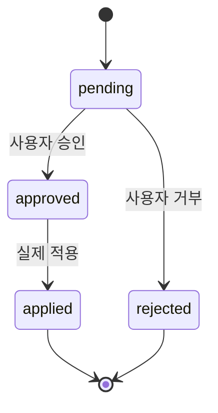

# Phase 15 — What-if 시뮬레이션 + 추천 대시보드 + 피드백 루프 (Layer 4b)

**신규 Phase. 사용자가 추천을 검토하고, What-if로 결과를 미리 확인한 뒤, 승인하여 실제 반영하는 전체 루프를 완성한다.**

---

## 1. 목표

1. **Backend**: What-if dry-run 시뮬레이션 엔드포인트
2. **Frontend**: Recommendation 대시보드 (추천 목록 + What-if 미리보기 + Before/After 비교)
3. **Action 피드백 루프**: 추천 승인 → 실제 시뮬레이션 트리거 → 결과 추적 → 추천 상태 업데이트

### 이 Phase가 완성하는 것

Phase 14까지는 "시스템이 추천을 생성"하는 단방향 흐름이다. Phase 15에서 "사용자가 검토 → 시뮬레이션으로 검증 → 승인 → 실행 → 결과 확인"의 **양방향 루프**가 완성된다. 이것이 단순 모니터링과 운영 의사결정 지원의 차이다.

```
Pipeline           Backend              Frontend
  │                  │                    │
  ├─ Recommendation ─┤                    │
  │                  │                    │
  │                  │  ←── GET /recommendations
  │                  │  ──→ 추천 목록        │
  │                  │                    │
  │                  │  ←── POST /what-if  │
  │                  │  ──→ Before/After   │
  │                  │                    │
  │                  │  ←── POST /apply    │
  │                  │  ──→ 실제 시뮬레이션   │
  │                  │                    │
  │  ←── 결과 이벤트 ──┤  ──→ 결과 반영      │
```

---

## 2. 선행 조건

- Phase 12 완료 (`EngineStateApplier`에 `dryRun` 분기 포인트 존재)
- Phase 14 완료 (Recommendation 도메인 + API 존재)

---

## 3. Backend: What-if dry-run 시뮬레이션

### 3.1 엔드포인트

```
POST /api/simulation/what-if
```

**Request Body**

```json
{
  "triggerAssetId": "battery-1",
  "patch": {
    "properties": { "chargeRate": 500 }
  },
  "maxDepth": 3
}
```

기존 `POST /api/simulation/run`과 동일한 입력이지만, 상태를 영구 저장하지 않고 결과만 반환한다.

**Response**

```json
{
  "runId": "whatif-abc123",
  "before": {
    "battery-1": {
      "properties": { "storedEnergy": 3000, "chargeRate": 100 }
    },
    "generator-1": {
      "properties": { "power": 500 }
    }
  },
  "after": {
    "battery-1": {
      "properties": { "storedEnergy": 3400, "chargeRate": 500 }
    },
    "generator-1": {
      "properties": { "power": 500 }
    }
  },
  "deltas": [
    {
      "objectId": "battery-1",
      "changes": [
        { "key": "storedEnergy", "before": 3000, "after": 3400, "delta": 400 },
        { "key": "chargeRate", "before": 100, "after": 500, "delta": 400 }
      ]
    }
  ],
  "affectedObjects": ["battery-1"],
  "propagationDepth": 1
}
```

### 3.2 구현

```csharp
public sealed record WhatIfResult
{
    public required string RunId { get; init; }
    public required Dictionary<string, StateSnapshot> Before { get; init; }
    public required Dictionary<string, StateSnapshot> After { get; init; }
    public required IReadOnlyList<ObjectDelta> Deltas { get; init; }
    public required IReadOnlyList<string> AffectedObjects { get; init; }
    public int PropagationDepth { get; init; }
}

public sealed record StateSnapshot
{
    public required IReadOnlyDictionary<string, object> Properties { get; init; }
}

public sealed record ObjectDelta
{
    public required string ObjectId { get; init; }
    public required IReadOnlyList<PropertyChange> Changes { get; init; }
}

public sealed record PropertyChange
{
    public required string Key { get; init; }
    public object? Before { get; init; }
    public object? After { get; init; }
    public object? Delta { get; init; }
}
```

**흐름**

1. 영향 받을 에셋들의 현재 State 스냅샷 저장 → `Before`
2. `RunSimulationCommandHandler.RunAsync()` 호출 시 `dryRun: true` 전달
3. `EngineStateApplier`가 상태 계산만 수행 (저장/발행 건너뜀)
4. 계산 결과로 `After` 스냅샷 구성
5. `Before` vs `After` 비교하여 `Deltas` 생성
6. `WhatIfResult` 반환

### 3.3 Controller

```csharp
[HttpPost("what-if")]
public async Task<ActionResult<WhatIfResult>> WhatIf(
    [FromBody] RunSimulationRequest request,
    CancellationToken ct)
{
    var result = await _whatIfService.RunAsync(request, ct);
    return Ok(result);
}
```

---

## 4. Backend: Recommendation Apply

### 4.1 엔드포인트

```
POST /api/recommendations/{id}/apply
```

**흐름**

1. Recommendation 조회 (Pipeline MongoDB에서, 또는 Backend가 캐시)
2. `suggested_action`에서 `triggerAssetId`, `patch` 추출
3. 실제 `POST /api/simulation/run` 로직 실행 (dryRun: false)
4. Recommendation 상태를 `applied`로 업데이트
5. 실행 결과 이벤트 발행: `factory.recommendation.applied`

### 4.2 Recommendation 상태 전이



---

## 5. Frontend: Recommendation 대시보드

### 5.1 페이지 구조

```
/recommendations
  ├─ RecommendationListPage
  │    ├─ 필터 (severity, category, status)
  │    ├─ 추천 카드 목록
  │    │    ├─ severity 아이콘/색상
  │    │    ├─ 제목, 설명
  │    │    ├─ 대상 객체
  │    │    └─ 액션 버튼 (What-if, Approve, Reject)
  │    └─ 페이지네이션
  │
  └─ RecommendationDetailPanel (사이드 패널 또는 모달)
       ├─ 분석 근거 (trend slope, predicted time)
       ├─ 제안 액션
       ├─ What-if 미리보기 (Before/After 비교)
       │    ├─ 속성 테이블: 변경 전/후/차이
       │    └─ 영향 받는 객체 목록
       └─ 적용 버튼 → 확인 다이얼로그
```

### 5.2 What-if 미리보기 컴포넌트

```
WhatIfPreview
  ├─ "What-if 실행" 버튼
  ├─ 로딩 상태
  └─ 결과 표시
       ├─ Before/After 비교 테이블
       │    ├─ 속성 키
       │    ├─ 변경 전 값
       │    ├─ 변경 후 값
       │    └─ 차이 (delta)
       ├─ 영향 범위 (affectedObjects 수, propagationDepth)
       └─ "이 변경을 적용하시겠습니까?" → Apply 버튼
```

### 5.3 라우팅

```typescript
{ path: '/recommendations', element: <RecommendationListPage /> }
```

### 5.4 API 연동

- `GET /api/recommendations` → Pipeline FastAPI
- `POST /api/simulation/what-if` → Backend API
- `POST /api/recommendations/{id}/apply` → Backend API (또는 Backend → Pipeline 상태 업데이트 연동)
- Kafka SSE: `factory.recommendation.generated` 이벤트로 실시간 새 추천 알림

---

## 6. Action 피드백 루프

추천이 적용된 후 실제 결과를 추적하여 추천 품질을 평가하는 루프.

### 6.1 흐름

```
1. 추천 생성 (Pipeline) → status: pending
2. 사용자 What-if 검토 (Frontend → Backend)
3. 사용자 승인 → status: approved
4. 실제 적용 (Backend 시뮬레이션) → status: applied
5. 적용 후 이벤트 스트림 모니터링 (Pipeline)
6. 예상 결과 vs 실제 결과 비교 → outcome 필드 업데이트
```

### 6.2 Recommendation 확장 필드

```python
@dataclass
class RecommendationOutcome:
    applied_at: datetime
    applied_run_id: str
    expected_change: dict    # { "storedEnergy": { "delta": 400 } }
    actual_change: dict | None  # 적용 후 N tick 후 실측
    accuracy: float | None   # expected vs actual 비교 (0.0 ~ 1.0)
    evaluated_at: datetime | None
```

### 6.3 결과 평가 (Pipeline)

- 추천 적용 후 설정된 tick 수(예: 10 tick)만큼 대기
- 해당 객체의 실제 상태 변화를 추출
- `expected_change` vs 실제 변화 비교 → `accuracy` 계산
- `recommendations` 컬렉션 업데이트

### 6.4 MVP 범위

- 적용 → 상태 전이 → 결과 이벤트까지 구현
- `accuracy` 자동 평가는 MVP 이후로 미루고, 필드만 선언
- 대시보드에 "적용 완료" 표시까지 구현

---

## 7. Kafka 토픽 추가

| 토픽 | 발행자 | 소비자 | 내용 |
| --- | --- | --- | --- |
| `factory.recommendation.generated` | Pipeline | Frontend (SSE) | 새 추천 생성 |
| `factory.recommendation.applied` | Backend | Pipeline | 추천 적용 결과 |

---

## 8. 거버넌스

- What-if API는 상태를 변경하지 않음 (읽기 전용 시뮬레이션)
- Recommendation apply는 사용자 확인 필수 (프론트엔드에서 다이얼로그)
- 동시에 여러 추천을 적용할 때 충돌 방지: 적용 시점의 State 스냅샷을 기준으로 실행
- MVP에서는 인증/권한 없음, 확장 시 역할 기반 승인 추가

---

## 9. 테스트

| 테스트 | 검증 내용 |
| --- | --- |
| `WhatIfServiceTests` | dry-run 결과 정확성, Before/After/Deltas |
| `WhatIfControllerTests` | API 엔드포인트 응답 형식 |
| `RecommendationApplyTests` | 적용 → 시뮬레이션 실행 → 상태 전이 |
| `RecommendationListPage.test` | 추천 목록 렌더링, 필터, 페이지네이션 |
| `WhatIfPreview.test` | Before/After 비교 테이블 렌더링 |
| `ApplyConfirmDialog.test` | 적용 확인 다이얼로그 동작 |
| `FeedbackLoopTests` | 적용 후 상태 추적 (Pipeline 단위 테스트) |

---

## 10. 완료 기준

- [x] `POST /api/simulation/what-if` 엔드포인트 동작 (상태 변경 없이 결과 반환)
- [x] `WhatIfResult`에 Before/After/Deltas 포함
- [x] `POST /api/recommendations/{id}/apply` 엔드포인트 동작
- [x] Recommendation 상태 전이 (pending → approved → applied)
- [x] Frontend 추천 목록 페이지
- [x] Frontend What-if 미리보기 컴포넌트 (Before/After 비교 테이블)
- [x] Frontend 적용 확인 다이얼로그
- [x] Kafka `factory.recommendation.applied` 이벤트 발행
- [x] MVP 피드백 루프 ("적용 완료" 표시)
- [x] 모든 테스트 통과

---

## 11. 산출물

| 산출물 | 변경 유형 |
| --- | --- |
| `WhatIfResult.cs`, `StateSnapshot.cs`, `ObjectDelta.cs`, `PropertyChange.cs` | 신규 |
| `WhatIfService.cs` | 신규 |
| `SimulationController.cs` (what-if 엔드포인트) | 수정 |
| `RecommendationApplyController.cs` 또는 기존 Controller 확장 | 신규/수정 |
| `EngineStateApplier.cs` (dryRun 실제 분기) | 수정 |
| `RecommendationListPage.tsx` | 신규 |
| `RecommendationDetailPanel.tsx` | 신규 |
| `WhatIfPreview.tsx` | 신규 |
| `routes.tsx` | 수정 |
| Pipeline `recommendation/value_objects.py` (outcome 필드) | 수정 |
| Pipeline 피드백 루프 로직 | 신규 |
| `shared/api-schemas/what-if.json` | 신규 |
| 테스트 7건 | 신규/수정 |

---

## 12. 확장 시 변경 예상

| 규모 변화 | 현재 설계 | 확장 시 변경 |
| --- | --- | --- |
| 다중 What-if 시나리오 비교 | 단일 What-if | 시나리오 목록 + 비교 뷰 |
| 자동 추천 적용 | 수동 승인만 | 자동 승인 정책 (severity + accuracy 기반) |
| 추천 품질 학습 | 필드만 선언 | accuracy 기반 규칙 가중치 조정 |
| 협업 | 인증 없음 | 역할 기반 승인 워크플로우 |

---

## 13. 참고

- [Phase 12 — SimulationBehavior 엔진](phase-12-simulation-behavior.md) — dryRun 분기 포인트
- [Phase 14 — Pipeline Analytics](phase-14-pipeline-analytics.md) — Recommendation 도메인
- [00-overview.md](00-overview.md) — 전체 로드맵
