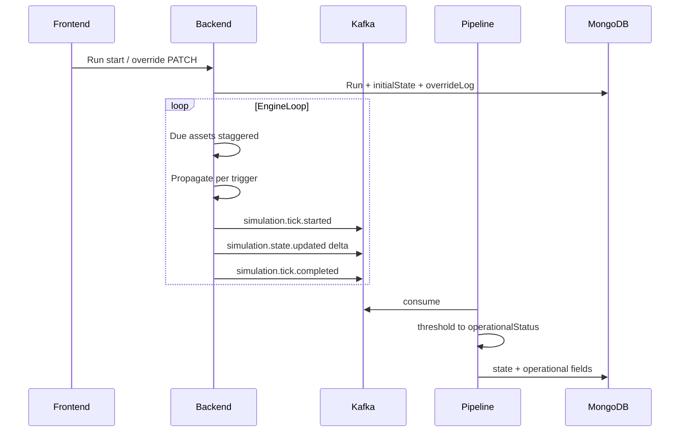

# Phase 21 — 시뮬레이션 거버넌스 (이벤트·재현·역할 분담)

**What-if 시뮬레이션의 재현 가능성, Kafka 비용, 백엔드 vs 파이프라인 역할을 계약과 코드로 고정한다.**  
Phase 12(시뮬 엔진)·13(관계 전파)·15(What-if UI) 이후, 운영 품질을 위한 횡단 관심사(cross-cutting) Phase다.

---

## 1. 목표

- 시뮬 Run의 **Tick·전파·발행** 의미를 문서와 이벤트 스키마로 명확히 하여, 소비자(파이프라인·프론트)가 동일한 가정으로 동작하게 한다.
- **변조(override)·Fault injection**을 초기 상태 + 이력만으로 재현·감사 가능하게 한다(전 Tick 풀 스냅샷 저장은 기본 안 함).
- Kafka 상에서 **불필요한 풀 상태 브로드캐스트**를 줄이고, **델타 + Tick Envelope**로 부분 저장 race를 완화할 수 있는 계약을 제공한다.
- **시뮬 결과 properties**와 **운영 임계·알림용 status**의 책임을 분리하여 필드 충돌과 이중 진실을 제거한다.

### as-is 대비 변경

| 항목           | as-is                                                                      | Phase 21 to-be                                                 |
| -------------- | -------------------------------------------------------------------------- | -------------------------------------------------------------- |
| 엔진 Tick 의미 | `SimulationEngineService`가 참여 에셋 전원에 풀 프로퍼티 알림              | **변경된 노드만** 델타 발행; Tick 경계 이벤트 추가             |
| 이벤트 스키마  | `simulation.state.updated`에 레거시 `temperature`/`power` 필수 등          | 범용 `properties` + `changes` + 선택적 **v2 / oneOf** 하위호환 |
| 재현 데이터    | Run에 `Trigger`, `TickIndex` 중심                                          | **초기 상태 + override 이력** (fromTick, optional toTick)      |
| status         | 백엔드 `ComputeState`와 파이프라인 `calculate_state`가 유사 필드 사용 가능 | **관심사 분리**: 시뮬 vs 운영 필드 명시                        |

---

## 2. 제약

- [`shared/event-schemas/`](../../../shared/event-schemas/) 및 [`shared/api-schemas/openapi.json`](../../../shared/api-schemas/openapi.json)이 Kafka·HTTP 계약의 **단일 소스**다. 변경 시 백엔드·파이프라인·프론트에 순서 있게 전파한다.
- 스키마 진화는 **하위호환**을 우선한다. 기존 소비자가 있는 동안 `oneOf`로 구 페이로드와 신규 페이로드를 병행할 수 있다.
- 현재 규모에서는 **Airflow 등 별도 오케스트레이터**를 도입하지 않는다. 전파 순서는 기존 백엔드 BFS·Run Tick 모델을 확장한다.

---

## 3. 선행 조건

- 지속 시뮬 Run·전파·Kafka 발행이 동작하는 코드 경로 존재 (Phase 12·13 및 현행 `SimulationEngineService`, `RunSimulationCommandHandler`).
- 파이프라인이 `simulation.state.updated`를 소비하는 구조 존재.

---

## 4. 확정된 설계 결정 (Plan 단계 합의)

| #   | 주제        | 선택                          | 구현 시 유의점                                                                                                                                                                                                                              |
| --- | ----------- | ----------------------------- | ------------------------------------------------------------------------------------------------------------------------------------------------------------------------------------------------------------------------------------------- |
| 1   | Tick 의미   | **에셋별 due (Staggered )**   | [`SimulationEngineService`](../../../servers/backend/DotnetEngine/Application/Simulation/Workers/SimulationEngineService.cs)의 `GetDueAssetIdsAsync`, 에셋 `metadata.tickIntervalMs` 유지·문서화. Run 전역 단일 스냅샷은 **강제하지 않음**. |
| 2   | 변조·재현   | **초기 상태 + override 이력** | Mongo Run 문서(또는 별 컬렉션)에 이력 배열; Tick마다 전 그래프 스냅샷은 기본 비저장.                                                                                                                                                        |
| 3   | 이벤트 계약 | **델타 + Tick Envelope**      | `tick.started` / `tick.completed` + 노드별 변경분; 무변경 미발행.                                                                                                                                                                           |
| 4   | status 소유 | **관심사 분리**               | 백엔드 이벤트·상태는 시뮬 **properties** 중심; 파이프라인 저장·알림은 **`operationalStatus`** 등 **별 키**로 확정.                                                                                                                          |

---

## 5. 아키텍처

### 5.1 시퀀스 (요약)



### 5.2 Tick Envelope의 범위 (Staggered due)

글로벌 스냅샷 Tick이 아니므로, “한 시뮬 시각에 전 참여자가 동일 입력”은 보장하지 않는다. 대신 Envelope는 **한 번의 엔진 루프 iteration** 또는 **Run.TickIndex 증가 직후의 처리 배치**에 대응시키는 것이 현실적이다.

권장 정의:

- **`simulation.tick.started`**: `runId`, `engineCycleId` 또는 `tickIndex`, `dueAssetIds[]`, `timestamp`.
- **`simulation.tick.completed`**: 동일 식별자 + `changedAssetIds[]` 요약.

소비자는 **`tick.completed` 수신 후** 해당 사이클에 속한 델타를 커밋하는 방식으로 부분 저장 race를 줄인다.

### 5.3 관심사 분리 (status)

| 층              | 필드 예시                                    | 책임                                                                                |
| --------------- | -------------------------------------------- | ----------------------------------------------------------------------------------- |
| 백엔드 시뮬     | `properties` (전파·시뮬레이터 결과)          | 물리량·파생 수치. 운영 알림의 **최종 단정**은 하지 않거나, 별도 비권위 힌트만 허용. |
| 파이프라인·저장 | `operationalStatus`, `operationalMessage` 등 | ObjectType 스키마 threshold·파이프라인 규칙으로 **경고/장애** 확정.                 |

기존 [`asset_pipeline.py`](../../../servers/pipeline/src/pipelines/asset_pipeline.py) `calculate_state`의 `status`와 백엔드 [`RunSimulationCommandHandler.ComputeState`](../../../servers/backend/DotnetEngine/Application/Simulation/Handlers/RunSimulationCommandHandler.cs) 출력이 **동일 Mongo 필드**를 덮지 않도록 마이그레이션 계획을 Phase 21 구현 단계에 포함한다.

---

## 6. 공유 계약 설계

### 6.1 `simulation.state.updated` 진화

- **목표 페이로드**: 범용 `properties` + 선택적 `propertyChanges` (각 키에 `from` / `to`).
- **호환 전략 (택 1, 구현 시 확정)**:
  - **A)** 스키마 `oneOf`: 레거시 `NodeUpdatePayload` + 신규 `DeltaPayload` 병행.
  - **B)** `schemaVersion` 또는 `eventType` 변형 토픽으로 분리 (운영 부담 증가).

권장: **A (oneOf)** 로 기존 파이프라인 점진 마이그레이션.

### 6.2 예시: 델타 페이로드 (신규 arm)

```json
{
  "eventType": "simulation.state.updated",
  "assetId": "freezer-01",
  "runId": "abc123",
  "schemaVersion": "v1",
  "timestamp": "2026-04-06T12:00:00Z",
  "payload": {
    "tickIndex": 42,
    "depth": 1,
    "relationshipType": "Supplies",
    "fromAssetId": "power-supply-01",
    "properties": { "powerAvailable": 750 },
    "propertyChanges": {
      "powerAvailable": { "from": 900, "to": 750 }
    }
  }
}
```

(실제 필드명은 구현 시 JSON Schema에 고정.)

### 6.3 신규 이벤트 타입

- `simulation.tick.started`
- `simulation.tick.completed`

파일 위치: [`shared/event-schemas/schemas/`](../../../shared/event-schemas/schemas/), 등록: [`shared/event-schemas/topics/topics.json`](../../../shared/event-schemas/topics/topics.json), [`versions/v1.json`](../../../shared/event-schemas/versions/v1.json).

### 6.4 OpenAPI

- Run **override 추가/목록/삭제** 또는 PATCH: [`openapi.json`](../../../shared/api-schemas/openapi.json)에 정의 후 백엔드 컨트롤러·DTO 반영.

---

## 7. 서비스별 구현 범위

### 7.1 백엔드 (C#)

| 영역                                                                                                                         | 작업                                                                                                                                                                                                                  |
| ---------------------------------------------------------------------------------------------------------------------------- | --------------------------------------------------------------------------------------------------------------------------------------------------------------------------------------------------------------------- |
| [`SimulationEngineService`](../../../servers/backend/DotnetEngine/Application/Simulation/Workers/SimulationEngineService.cs) | `EmitTickEventsAsync`를 풀 브로드캐스트에서 **이전 사이클 대비 diff** + Tick Envelope 순서 발행으로 전환. 이전 상태 캐시는 Run-scoped 또는 참여 에셋 집합 한정.                                                       |
| Run 영속화                                                                                                                   | [`SimulationRunDto`](../../../servers/backend/DotnetEngine/Application/Simulation/Dto/SimulationRunDto.cs) / Mongo: `initialStateSnapshot`, `overrides[]` (`assetId`, `propertyKey`, `value`, `fromTick`, `toTick?`). |
| 전파                                                                                                                         | Staggered 유지. 단일 `RunOnePropagationAsync` 호출 내부는 기존 BFS 일관성 유지.                                                                                                                                       |
| 발행                                                                                                                         | 운영 **authoritative status**를 이벤트의 유일한 진실로 쓰지 않음 (결정 4).                                                                                                                                            |

### 7.2 파이프라인 (Python)

| 영역      | 작업                                                                                                                      |
| --------- | ------------------------------------------------------------------------------------------------------------------------- |
| Consumer  | Tick Envelope·델타 페이로드 파싱; `tick.completed`와 짝 맞추기.                                                           |
| 상태 저장 | `operationalStatus` 등 분리 필드로 기록; [`asset_worker.py`](../../../servers/pipeline/src/workers/asset_worker.py) 갱신. |
| 알림      | 기존 alert 경로는 operational 층 기준 유지.                                                                               |

### 7.3 프론트엔드

- 시뮬 뷰: 델타 기반 노드 속성 패치; Run override UI는 새 Run API와 연동 (Phase 15 What-if UI와 정렬).

---

## 8. 거버넌스·테스트

- 스키마 변경 후 [`.claude/skills/validate-schema/SKILL.md`](../../../.claude/skills/validate-schema/SKILL.md) 절차로 백엔드·프론트·파이프라인 정합 확인.
- 백엔드: `RunSimulationCommandHandlerTests`, 시뮬 엔진·발행 관련 테스트.
- 파이프라인: `tests/pipelines/test_asset_pipeline.py`, worker 테스트.

---

## 9. 권장 구현 순서

1. **계약**: `simulation.state.updated` oneOf 확장 + `simulation.tick.*` 스키마·토픽 등록 + 예시 JSON 고정.
2. **Run API + Mongo**: override 이력 모델 및 CRUD/PATCH.
3. **백엔드 발행**: 델타 계산 + Tick Envelope 순서; 기존 풀 발행 제거 또는 플래그 전환.
4. **파이프라인**: 신규 이벤트 소비, operational 필드 분리, `tick.completed` 배치 커밋.
5. **프론트**: 최소 연동(델타 반영 + override 호출).

---

## 10. 완료 기준 (Definition of Done)

1. 공유 이벤트 스키마·토픽이 Phase 21 계약을 반영하고 문서화되어 있다.
2. Run에 override 이력을 저장·조회할 수 있는 API가 OpenAPI와 구현에 존재한다.
3. 백엔드가 델타 + Tick Envelope를 발행한다(테스트 또는 통합 검증).
4. 파이프라인이 운영 status를 시뮬 properties와 분리된 필드로 기록한다.
5. `validate-schema` 및 관련 자동 테스트가 통과한다.

---

## 11. 규모에 맞는 정당성·확장

- **현재**: 단일 백엔드 프로세스 + 단일 파이프라인 consumer로 충분. Tick Envelope는 순서 이해용 메타데이터 수준.
- **확장 시**: 파티션 키(`runId`) 정렬, Flink 등 스트림 처리, 또는 tick 단위 스냅샷 아카이브는 트래픽·규제 요구가 생길 때 검토.

---

## 12. 참고 코드 경로

- 엔진 루프: [`SimulationEngineService.cs`](../../../servers/backend/DotnetEngine/Application/Simulation/Workers/SimulationEngineService.cs)
- 전파: [`RunSimulationCommandHandler.cs`](../../../servers/backend/DotnetEngine/Application/Simulation/Handlers/RunSimulationCommandHandler.cs)
- 레거시 이벤트 스키마: [`simulation.state.updated.json`](../../../shared/event-schemas/schemas/simulation.state.updated.json)
- 파이프라인: [`asset_worker.py`](../../../servers/pipeline/src/workers/asset_worker.py), [`asset_pipeline.py`](../../../servers/pipeline/src/pipelines/asset_pipeline.py)
