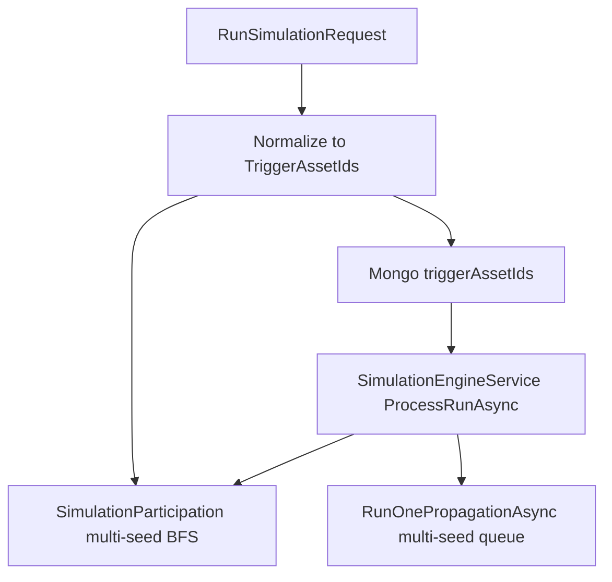

# Phase 23 — 다중 시드 단일 런 (S2)

**한 번의 연속 시뮬 시작(또는 단발 `POST /runs`)에 여러 시드를 담고, 동일 참여 집합·틱 의미 안에서 BFS 전파가 다중 루트에서 시작되도록 한다.**  
단일 소스 계약은 [`shared/api-schemas/openapi.json`](../../../shared/api-schemas/openapi.json)을 따른다.

---

## 1. 목표

- `StartContinuousRun` 및 `POST /api/simulation/runs`가 **복수 시드**를 한 런에 저장·실행할 수 있다.
- **참여 집합**: 나가는 관계만 BFS할 때 **모든 시드를 초기 큐에 넣어** 탐색한다(합집합 의미, 구현은 `SimulationParticipation`).
- **레거시** 단일 `triggerAssetId`만 보내는 클라이언트는 **서버에서 `[triggerAssetId]`로 승격**된다.

---

## 2. 제약 (MVP)

| 항목 | 규칙 |
| --- | --- |
| 패치 | **다중 시드**일 때 **의미 있는 patch 불가**(`status`/`lastEventType`/비어 있지 않은 `properties` 값). 후속 Phase에서 에셋별 패치 검토. |
| 계약 | **`triggerAssetIds`** 권장(비어 있지 않으면 **배열이 `triggerAssetId`보다 우선**). 둘 다 없으면 400. |
| 저장 | Mongo·`SimulationRunDto`는 **`triggerAssetIds`** 배열; **`triggerAssetId`**는 **첫 시드**의 계산 프로퍼티·JSON 호환. |
| 레거시 DB | 문서에 **`triggerAssetIds`만 없고 `triggerAssetId`만** 있으면 읽기 시 배열로 승격. |

---

## 3. 구현 순서 (완료 기준과 대응)

1. **OpenAPI** — `RunSimulationRequest`: `triggerAssetId`·`triggerAssetIds` 기술, 서버 정규화·patch 정책 설명; `SimulationRunDetailDto`에 `triggerAssetIds` + `triggerAssetId`(첫 시드).
2. **C#** — `RunSimulationRequest`, `RunSimulationRequestExtensions.ResolveTriggerAssetIds` / `IsMultiSeedPatchDisallowed`, 핸들러·컨트롤러 검증.
3. **Mongo** — `MongoSimulationRunDocument`·리포지토리: 쓰기 시 배열+레거시 필드, 읽기 시 정규화.
4. **참여** — `SimulationParticipation.GetParticipatingAssetIdsAsync(IReadOnlyList<string> seeds, …)` 다중 시드 BFS, 중복 시드 제거.
5. **연속 런** — `StartContinuousRunCommandHandler`가 정규화된 시드·참여 집합·스냅샷을 사용.
6. **엔진** — `SimulationEngineService`가 `run.TriggerAssetIds`로 참여 계산; 전원 due 시 `RunOnePropagationAsync`에 **전체 시드** 전달.
7. **전파** — `RunOnePropagationAsync` BFS 큐를 시드마다 `(assetId, patch, 0)`으로 시드.
8. **What-if** — 다중 루트에서 영향 집합 수집.
9. **프론트** — `RunSimulationRequestDto`·`simulationApi`; `RunSimulationOnPanel`에서 지속 실행도 **다중 체크 시드** 허용, 단일 시드는 `triggerAssetId`·복수는 `triggerAssetIds`로 전송.
10. **테스트** — 백엔드: 연속 런 다중 시드·patch 금지·`RunOnePropagation` 다중 시드; 프론트: API body.

---

## 4. 아키텍처 (요약)

---

## 5. 리스크 / 후속

- **파이프라인·Kafka**: 런 메타에 `triggerAssetId`만 노출 중이면 **첫 시드**만 보일 수 있다. 배열 전파는 별도 결정.
- **중복 시드**: 요청·저장 모두 dedupe 후 사용.

### 5.1 후속 (Fan-in / 설계 B)

- **문제**: 다중 시드 BFS에서 동일 수렴 노드가 `visited`로 **첫 방문만** 처리되면, 관계 매핑으로 들어오는 **서로 다른 target 키**(`streamInput_a` 등)가 큐에 남아도 반영되지 않을 수 있다.
- **대응**: `RunOnePropagationAsync`에서 (1) BFS 트리 `parent`로 **백 엣지**를 감지해 기존 **cycle 누적** 경로를 유지하고, (2) 그 외 **이미 방문한 노드**로의 재진입은 **fan-in 병합**(동일 키 숫자 합, 설계 B에서는 키가 겹치지 않으면 속성 합집합) 후 다시 하류로 전파한다.
- **UI**: 캔버스 노드 `liveProperties`는 `streamCapacity`·`capacity` → `streamInput*` → 기타 순으로 정렬해 임계치와 입력을 구분해 표시한다.

---

## 6. 완료 기준 (Done)

- OpenAPI·C#·TypeScript·Mongo가 **`triggerAssetIds`** 처리에 정합한다.
- 연속 실행이 **다중 시드**로 시작하고 엔진 틱이 정상 동작한다.
- 레거시 **단일 `triggerAssetId`** 요청이 동작한다.
- 다중 시드 + 의미 있는 patch는 **거절**된다(핸들러 또는 400).

---

## 7. 규모에 대한 말

현재 단일 백엔드·단일 Mongo 컬렉션 모델에서 **배열 필드 추가와 정규화 헬퍼**로 끝난다. 시드 수가 매우 커지면 요청 크기 제한·인덱스·이벤트 페이로드 분리를 검토하면 된다.
